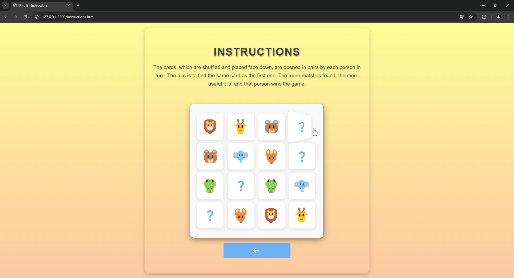
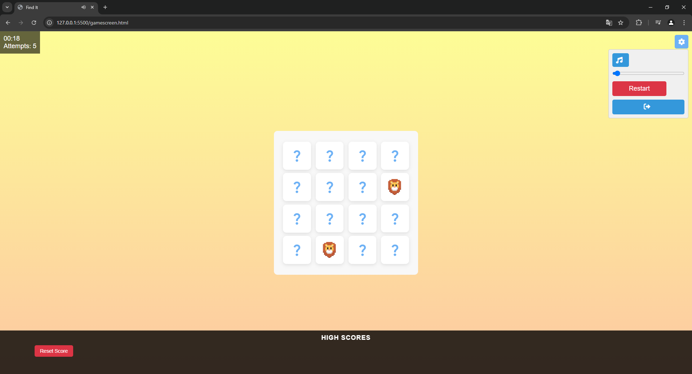

# Find It - Memory Card Game

Find It is a fun and engaging memory card game designed to test and improve your memory skills. The objective of the game is to find and match pairs of identical cards, with the fewest attempts possible. This project is developed with HTML, CSS, and JavaScript, and is a simple yet challenging game for all ages.


## Features

* 🃏 **Memory Matching Game:** Flip the cards and find pairs of matching cards.
* ⏲️ **Timer:** Track how long it takes to complete the game.
* 📈 **High Scores:** The top 5 best scores are saved locally and displayed on the scoreboard.
* 🔁 **Reset Scores:** Clear the saved high scores with a simple button click.
* 🎵 **Settings Menu:** Toggle background music and adjust the volume.
* 📱 **Responsive Design:** Play the game on desktop or mobile devices.

  ## How to Play
  1. Click on two cards to reveal them.
  2. If the cards match, they remain face-up. If not, they are flipped back.
  3. The goal is to match all pairs with the fewest attempts and in the shortest time possible.

  ## Instructions
  To learn more about how to play, click on the Instructions button in the main menu. A video tutorial is also available to help you get started.
  
## License

This project is licensed under the [MIT](https://choosealicense.com/licenses/mit/) License - see the LICENSE file for details. 

  
## Installation 

To run this project locally, follow these steps:
1. Clone the repository:
```bash 
  git clone https://github.com/yusufgul16/find-it.git

```

2. Navigate to the project folder:
```bash 
  cd find-it

```
3. Open index.html in your web browser to start playing.


## Demo
https://yuusufgul16.github.io/card-game/

## Screenshots
 
 
 
